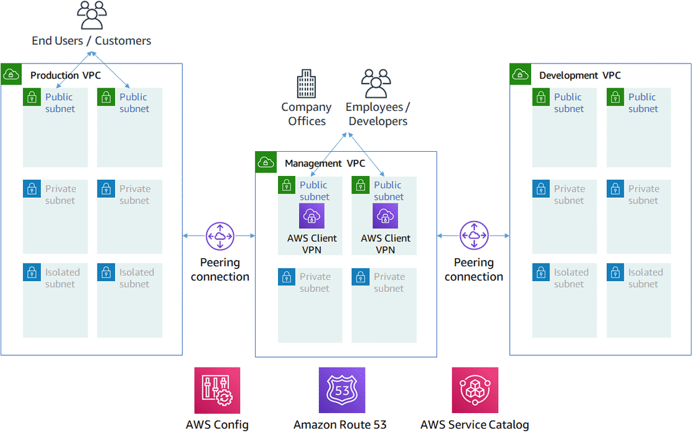
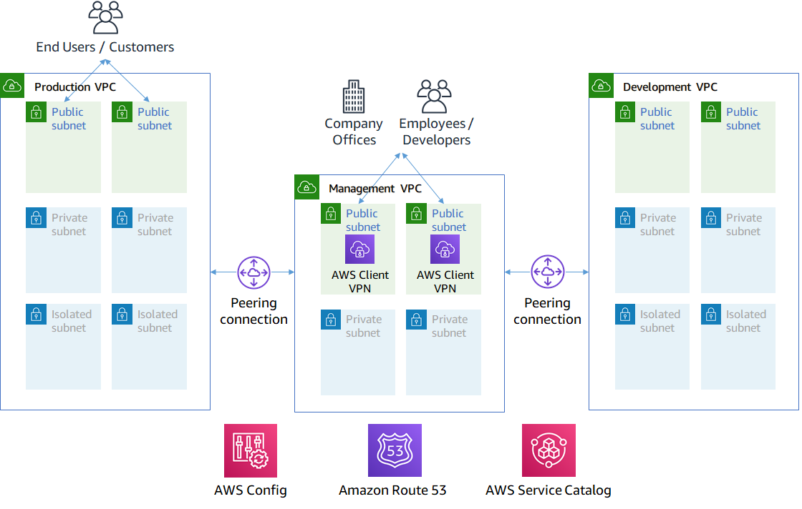

# [AWS Cloud Development Kit (CDK)]((https://aws.amazon.com/cdk/)) Blueprint

This is a strongly opinionated **CDK** architecture built for AWS best practices on **Day 1**.

Here is what a conventional n-tier application might look like in the **Blueprint Architecture**. 



The **Shared Services Platform** that allows multiple **Teams** to run **Applications** on **Shared Infrastructure** that is managed, secured, and governed by a **Centralize Infra Team**.

## 1. Install Instructions

There are two ways to deploy this. If you just want to get the above working in your account ASAP follow the **`1.1. CloudFormation`** instructions. 

If you value the principles of infrastructure as code, want to cleanly manage/adapt/update the architecture over time using code, or you already aware of how awesome the AWS CDK is, follow the **`1.2. CDK`** instructions.


### 1.1. Quick Install Option 1: `CloudFormation`

 Download the [pre-synthed CloudFormation Template (right click >> Save As)](https://raw.githubusercontent.com/nnthanh101/cdk/master/cdk.out/BlueprintStack.template.json) and use the [AWS CloudFormation - web console](https://console.aws.amazon.com/cloudformation/home?#/stacks/create/template) to deploy it. 
 
 > Should take ~ 7 min.


### 1.2. Install Option 1: `CDK` 

```bash
git clone https://github.com/nnthanh101/cdk.git
cd blueprint

npm run build 
cdk bootstrap
```

Feel free to make any changes you see fit. @FIXME: `.env`
* [ ] You might want to use different VPC CIDR ranges (`aws-vpcs.ts`)
* [ ] A different internal DNS apex (`aws-dns.ts` defaults to corp). 

When you are ready, to deploy or update the blueprint's architecture in the future, you just need to run.

```bash 
npm run build
cdk deploy
```



## Connect to the VPN

In order for you to route into the private subnets in the VPCs, you need to connect to the VPN. The blueprint has deployed a client vpn endpoint in the Management vpc that will NAT traffic over peering connections into the Production and Development VPCs. We are using the Management VPC as a hub VPC for networking into other VPCs. The Development and Production environments are designed to NOT be able to communicate with each other.


Once the deployment is complete, go to the AWS VPC web console, and scroll down to the "Client VPN Endpoints" section. Select the Client VPN Endpoint listed and click the "Download Client Configuration" button. Your browser will download a `downloaded-client-config.ovpn` file.

Now go to the AWS S3 web console and open the bucket prefixed `blueprintstack-clientvpnvpnconfigbucket*`. You will see 5 files listed. Download the `client1.domain.tld.key` and `client1.domain.tld.crt`. The other three files are the CA chain and server key/cert. You will need those if you want to create additional client certificates later on. For now, you just need `client1.domain.tld.key` and `client1.domain.tld.crt`.

At this point we have to edit make some tweaks to the `downloaded-client-config.ovpn` file so open it in a text editor:

Add the following lines to the bottom of the file:

```
<cert>
Contents of client certificate (client1.domain.tld.crt) file
</cert>

<key>
Contents of private key (client1.domain.tld.key) file
</key>
```

Save the `downloaded-client-config.ovpn`. You should be able to open/import that file with any OpenVPN client. You can find instructions for using the [AWS VPN Client](https://docs.aws.amazon.com/vpn/latest/clientvpn-user/connect-aws-client-vpn-connect.html) or the [official OpenVPN client](https://docs.aws.amazon.com/vpn/latest/clientvpn-user/connect.html) for Mac/Windows/Linux on our docs pages.

## Where to go from here?

Once you are connected to the VPN, you essentially have a private encrypted channel into your new VPCs. You can now connect to any resources you launch into your VPCs using **private** IP addresses without having to hassle with insecure/public bastion hosts. You can also utilize the private DNS setup in the `.corp` hosted zone in Route 53 with any private resources you create. For example, you may decide to launch a development server that gets a private IP like 10.60.0.198. Instead of you having to remember that IP, you can create an 'A' record in the `.corp` hosted zone for `.corp` and map it to the private IP. Resources in all three VPCs and clients connected to the Client VPN Endpoint will then all be able to resolve `.corp` from a browser, api call, etc. 

### Launching stuff. How to think about the VPCs and Subnets?

These are the primary **Landing Zones** for resources you deploy into AWS. You can think of VPCs as houses and the subnets as rooms. When you deploy a Load Balancer, EC2 instance, RDS Databases, etc you will need to tell AWS what VPC and subnet it should deploy into. 

If the resource you want to deploy is for Production or Development purposes, make sure to use the Production or Development VPC. Separating the Production and Development VPCs allows you to manage the environments with different levels of controls and restrictions. 

You want to use the Management VPC only for resources that more operational in nature, like a DevOps tool - Jenkins & GitLab, Active Directory, Security Compliance, etc. For example, the Blueprint deploys the Client VPN Endpoint into the Management VPC.

All three VPCs have similar classes of subnets. `Public`, `Private`, and `Isolated`. When you are deploying a resource, if the resource needs to be publically addressable by the internet at large, you need to specify the Public subnet. Ideally, this should only ever be things like AWS Application Load Balancers (ALB). If you are deploying a resource like application server that should never be directly internet facing (but perhaps sits behind an ALB) that still needs outbound internet access, use the Private subnet. If you are deploying a sensitive resource like a Database that should only be addressable to your internal networks and needs no outbound internet access, use the isolated subnets. 

**Why are there two subnets of the same class in each VPC?** This is an important requirement for high availability on AWS. Each subnet of the same class is in a different availability zone, which is to say a physically distinct data center. In the event of an availability zone outage, having another subnet in another availability zone allows your service or AWS services to cleanly failover. For example AWS Auto Scaling, RDS Multi-AZ, and the Client VPN Endpoint all take advantage of Multi-AZ capability for clean failover in the event of a physical disaster. Outside of the Subnets being in different AZ, Subnets of the same class are identical from a networking perspective, it really does not matter which one you choose.

### Give me an Example?

In short, when you are deploying a VPC aware resource into AWS (ALB, EC2, RDS, etc), consider first the VPC it should belong to then consider its level of isolation. Here are some examples:

* Need a `Server` where I'm going to test out installing an application to test out on my own or show to a coworker 
    * Development VPC, Private Subnet
* Restoring an `RDS` snapshot in Development into Production
    * Production VPC, Isolated Subnet
* Launching an `Application Load Balancer` to try installing a custom TLS certificate
    * Development VPC, Public Subnet
* Standing up a DevOps tool like `Jenkins` or `Gitlab` to automate deployments into Production and Development 
    * Management VPC, Private Subnet
* Standing up and Okta Cloud Connect appliance or `Active Directory`
    * Management VPC, Private Subnet


## CDK - useful commands

A CDK app with an instance of a stack (`BlueprintStack`) which contains an Amazon SQS queue that is subscribed to an Amazon SNS topic.

The `cdk.json` file tells the CDK Toolkit how to execute your app.

 * `npm run build`   compile typescript to js
 * `npm run watch`   watch for changes and compile
 * `npm run test`    perform the jest unit tests
 * `cdk deploy`      deploy this stack to your default AWS account/region
 * `cdk diff`        compare deployed stack with current state
 * `cdk synth`       emits the synthesized CloudFormation template