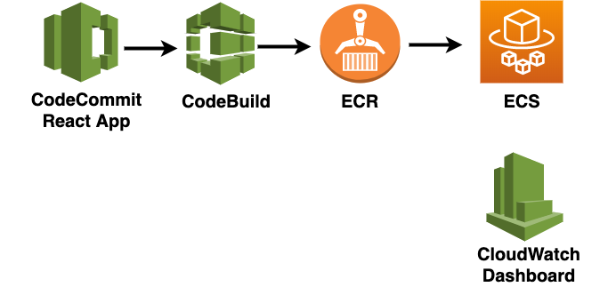
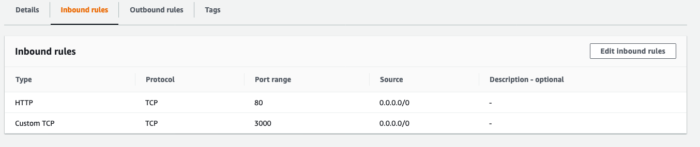
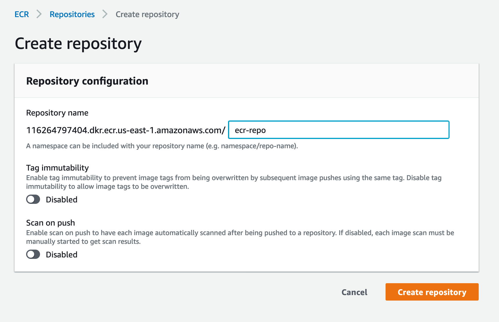
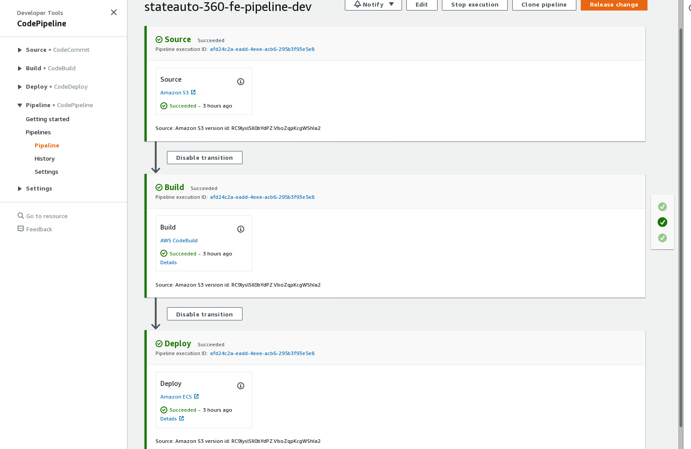

# Automated CI/CD Pipeline to deploy React Application Docker-Image to ECS using AWS CDK TypeScript

This solution uses AWS CDK to automatically launch a provisioned **CI/CD Pipeline**, build a **Docker Image** of the source repository containing a `React` application, deploy the Docker Image to an `ECS Fargate` service with an attached `Application Load Balancer`, and launch a `CloudWatch Dashboard` with key metrics for CI/CD Pipeline monitoring. This solution was originally built for a customer deploying to an internal corporate network, but has been modified to deploy a public URL served by the Application Load Balancer. The CI/CD Pipeline will be triggered by new updates to the source repository.

### 1.1. The SolutionArchitecture:



### 1.2. Benefits

This solution allows a CI/CD Pipeline to be launched into an AWS environment without having to build everything in the console & makes creation/deletion of the required Infrastructure fast & simple. It can also be used as a starting template for those getting started with AWS CDK.

The `cdk.json` file tells the CDK Toolkit how to execute your app.

# 2. CI/CD Pipeline

### 2.1. Setup Requirements

> Please do the following steps to make the CDK script ready for use in your AWS environment. They can be done using the AWS console or CLI.

1. Create or use an existing `VPC` (lookup the the VPC-ID or VPC-Name)
2. Create or use an existing `Secuirty Group` with allowed Inbound rules:
    * Type: HTTP, Protocol: TCP, Port: 80, Source: 0.0.0.0/0
    * Type: Custom TCP, Protocol: TCP, Port: 3000, Source: 0.0.0.0/0
    * Note the security group ID: 
      
4. Create an ECR repository and note the URI:
   
5. Create or use an existing React App and upload to a CodeCommit repository 
   > yarn create react-app react-boilerplate --template typescript
6. Add a Dockerfile and buildspec.yml file to your react repo
    * cd react-boilerplate
    * touch Dockerfile
    * touch buildspec.yml
7. Copy and paste the following into the Dockerfile

    ```
    FROM nnthanh101/alpine-node:12 AS builder
    WORKDIR /app
    COPY . .
    RUN npm install react-scripts -g --silent
    RUN yarn install
    RUN yarn run build
    ```

    ```
    FROM nnthanh101/alpine-node
    RUN yarn global add serve
    WORKDIR /app
    COPY --from=builder /app/build .
    EXPOSE 3000
    CMD ["serve", "-p", "3000", "-s", "."]
    ```

8. Copy and paste the following into the buildspec.yml file

    ```
    version: 0.2
    
    phases:
      pre_build:
        commands:
        - echo Logging in to Amazon ECR...
        - REPOSITORY_URI=YOUR_ECR_URI_HERE # Replace REPLACEME_REPO_URI with your ECR Repo URI where docker image is pushed to.
        - $(aws ecr get-login --no-include-email --region YOUR-REGION_HERE) # Replace your region here
      build:
        commands:
        - echo Build started on `date`
        - echo Building the Docker image...
        - docker build -t $REPOSITORY_URI:$CODEBUILD_RESOLVED_SOURCE_VERSION .
        - docker tag $REPOSITORY_URI:$CODEBUILD_RESOLVED_SOURCE_VERSION $REPOSITORY_URI:$CODEBUILD_RESOLVED_SOURCE_VERSION # This is the tag command from earlier
      post_build:
        commands:
        - echo Build completed on `date`
        - echo Pushing the Docker image...
        - docker push $REPOSITORY_URI:$CODEBUILD_RESOLVED_SOURCE_VERSION # Push Docker image to ECR
        - printf '[{"name":"AppContainer","imageUri":"%s"}]' $REPOSITORY_URI:$CODEBUILD_RESOLVED_SOURCE_VERSION > imagedefinitions.json
    artifacts:
        files: imagedefinitions.json
    ```
9. In the script above, replace your ECR URI in the REPOSITORY_URI=YOUR_ECR_URI_HERE located in the pre_build stage.
10. Replace the YOUR_REGION_HERE with your region

11. Note if your chosen region is different than your AWS default region, you will also need to update the following:
    * Open the file `ecs-pipeline.ts` located in the bin folder
    * Line 13- Replace process.env.CDK_DEFAULT_REGION with your region of choice e.g., 'ap-southeast-1'

12. Upload the react app to an AWS CodeCommit repository and note the name of the CodeCommit repository

## Modify CDK script
1. Clone or download this repo
2. Navigate to lib/pipeline-stack.ts in your code editor of choice
3. Replace the following lines with your ID
> Line 2x: Insert your `VPC ID`
> Line 3x: Insert your `Security Group ID`
> Line 15x: Insert your `Repository Name`

## Install CDK
Using your CLI
1. npm install -g aws-cdk

# CDK Deployment
When you are ready to deploy the script. Navigate to the CDK repo in your CLI. Run the following:
1. npm install
2. npm run build
3. cdk deploy
> Do you wish to deploy these changes (y/n)?
> y

4. After a successful build/deployment you can find your ALB DNS URL as an output on your CLI
> Example...
> Outputs:
> Pipeline.LoadBalancerDNS = XXX.ap-southeast-1.elb.amazonaws.com


## The following describes the stages of the CodeBuild script

#### Pre-Build Stage:
1. Logs-in to Amazon Elastic Container Registry (ECR)
2. Sets the current target ECR repository URI

#### Build Stage:

1. Launch DockerFile
  #### Docker Build:
  * Intall dependencies
  * Run build command
  * Set host port to 3000
  * Run serve command on port 3000
2. Tag the newly created docker image
3. Push docker image to ECR
4. Create an imagedefinitions.json file that specifies ECR URI and name of container
5. Upload artifact (imagedefinitions file) to S3 bucket

#### Deploy Stage:
1. The ECS cluster Task Definition pulls the latest ECR image into the container
2. The latest deployment can be found using the Application Load Balancer DNS URL

#### Screenshots of CI/CD Pipeline in AWS console:
The pipeline will automatically start a build run using the source repository:


### Snapshot of key resources launched
1. S3 Bucket for pipeline artifacts: ${AWS_ACCOUNT}-${AWS_REGION} bucket
2. CodePipeline project
3. ECS Cluster
4. Cluster Service
5. Task Definition
    * Container Port 3000 
6. Target Group
  * Port 3000 
7. Load Balancer
  * Listerner: HTTP 80
8. CloudWatch dashboard
9. IAM role: CodeBuild
10. IAM role: CodePipeline
11. IAM role: ECS task execution


## Useful commands

 * `npm run build`   compile typescript to js
 * `npm run watch`   watch for changes and compile
 * `npm run test`    perform the jest unit tests
 * `cdk deploy`      deploy this stack to your default AWS account/region
 * `cdk diff`        compare deployed stack with current state
 * `cdk synth`       emits the synthesized CloudFormation template

### Clean-up
To remove your deployed stack run:

> cdk destroy

Note: You may need to manually delete the generated S3 Bucket from your account.
